# 02 — Database ERD / مخطط قاعدة البيانات

> UUID داخلي + `display_id` منفصل للعرض. كل الجداول في schema `public` ما لم يُذكر غير ذلك.

## Domains

| Domain | Tables |
|---|---|
| **Identity & Admin** | `profiles`, `user_devices`, `user_sessions`, `admin_users`, `roles`, `permissions`, `role_permissions`, `admin_2fa`, `audit_logs` |
| **Agencies & BD** | `agencies`, `agency_levels`, `agency_members`, `agency_join_requests`, `agency_host_transfer_requests`, `agency_violations`, `agency_tasks`, `bd_managers`, `bd_levels`, `bd_agencies`, `bd_commissions` |
| **Hosts** | `hosts`, `host_levels`, `host_shifts`, `host_targets`, `host_earnings` |
| **Rooms & Realtime** | `rooms`, `room_members`, `room_mics`, `room_moderators`, `room_bans`, `room_messages`, `room_rankings` |
| **Messaging & Calls** | `conversations`, `conversation_members`, `messages`, `message_attachments`, `message_reactions`, `calls`, `call_participants` |
| **Posts** | `posts`, `post_media`, `post_comments`, `post_reactions` |
| **Gifts & Store** | `gifts`, `gift_categories`, `gift_effects`, `gift_transactions`, `lucky_gift_rules`, `store_items`, `user_inventory` |
| **VIP & Levels** | `vip_plans`, `vip_memberships`, `levels`, `level_rewards` |
| **Economy** | `wallets`, `wallet_accounts`, `wallet_ledger`, `withdrawals`, `withdrawal_reviews`, `recharge_packages`, `payment_methods`, `payment_transactions` |
| **Events** | `events`, `event_versions`, `event_rules`, `event_tasks`, `event_participants`, `event_scores`, `event_leaderboards`, `event_rewards`, `reward_claims` |
| **Daily Login** | `daily_login_campaigns`, `daily_login_rewards`, `daily_login_claims` |
| **Content Ops** | `banners`, `banner_placements`, `notifications`, `notification_campaigns` |
| **Moderation** | `reports`, `moderation_cases`, `penalties`, `appeals` |
| **Config / SDUI** | `app_config`, `app_config_versions`, `feature_flags`, `ui_sections`, `ui_components` |
| **AI Operator** | `ai_prompts`, `ai_drafts`, `ai_actions`, `ai_audit_logs` |
| **Support/Ops** | `support_tickets`, `system_health_logs` |

## Core Relationships (Mermaid)

```mermaid
erDiagram
  profiles ||--o{ user_devices : has
  profiles ||--o{ user_sessions : has
  profiles ||--o| hosts : "may be"
  profiles ||--o{ wallet_accounts : owns
  wallet_accounts ||--o{ wallet_ledger : records
  wallet_accounts ||--o{ withdrawals : requests

  agencies ||--o{ agency_members : contains
  agencies ||--o{ agency_join_requests : receives
  agencies ||--o{ agency_host_transfer_requests : source_target
  agencies }o--|| agency_levels : at_level
  agencies }o--o| bd_managers : managed_by

  bd_managers ||--o{ bd_agencies : oversees
  bd_managers ||--o{ bd_commissions : earns

  hosts ||--o{ host_earnings : earns
  hosts }o--|| host_levels : at_level
  hosts }o--o| agencies : belongs_to

  rooms ||--o{ room_members : contains
  rooms ||--o{ room_mics : has
  rooms ||--o{ room_moderators : moderated_by
  rooms ||--o{ room_messages : logs
  rooms ||--o{ room_bans : bans

  conversations ||--o{ messages : contains
  messages ||--o{ message_attachments : has
  messages ||--o{ message_reactions : has

  posts ||--o{ post_media : has
  posts ||--o{ post_comments : has
  posts ||--o{ post_reactions : has

  gifts }o--|| gift_categories : in
  gifts ||--o{ gift_transactions : records
  gift_transactions }o--|| profiles : sender
  gift_transactions }o--|| profiles : receiver

  events ||--o{ event_versions : versioned
  events ||--o{ event_rules : has
  events ||--o{ event_tasks : has
  events ||--o{ event_participants : has
  event_participants ||--o{ event_scores : scores
  events ||--o{ event_rewards : distributes
  event_rewards ||--o{ reward_claims : claimed

  banners }o--|| banner_placements : placed_at
  notification_campaigns ||--o{ notifications : sends

  reports ||--o{ moderation_cases : opens
  moderation_cases ||--o{ penalties : issues
  penalties ||--o{ appeals : may_appeal

  app_config ||--o{ app_config_versions : versioned
  ui_sections ||--o{ ui_components : contains

  admin_users ||--o{ audit_logs : performs
  roles ||--o{ role_permissions : grants
  permissions ||--o{ role_permissions : granted_by
  admin_users }o--|| roles : has

  ai_prompts ||--o{ ai_drafts : produces
  ai_drafts ||--o{ ai_actions : executes
  ai_actions ||--o{ ai_audit_logs : audited
```



## Column Conventions

- `id uuid PK default gen_random_uuid()`
- `display_id text unique` (short readable, e.g. `YMU-000123`, `AG-0042`)
- `created_at timestamptz default now()`, `updated_at timestamptz`
- `deleted_at timestamptz null` (soft delete)
- `metadata jsonb default '{}'::jsonb`
- Money = `bigint` (smallest unit, e.g. coins). Never `float`.
- Enums = PostgreSQL `CREATE TYPE ... AS ENUM`.

## Ledger Shape

```
wallet_ledger (
  id uuid pk,
  transaction_id text unique,        -- external ref
  idempotency_key text unique,
  wallet_account_id uuid fk,
  currency wallet_currency,          -- coin/pearl/bonus/event/agency/vip
  direction ledger_direction,        -- credit | debit
  amount bigint,                     -- always positive
  balance_before bigint,
  balance_after bigint,
  source ledger_source,              -- gift, recharge, withdrawal, event, admin_grant, refund...
  reason text,
  reference_id uuid,                 -- linked domain row
  created_by uuid fk admin_users,    -- null for system/user actions
  reviewed_by uuid fk admin_users,
  status ledger_status,              -- posted, reversed
  reversal_of uuid fk wallet_ledger, -- for Reverse entries
  metadata jsonb,
  created_at timestamptz
)
```

Full column-by-column DDL ships in Phase 1 migrations.
